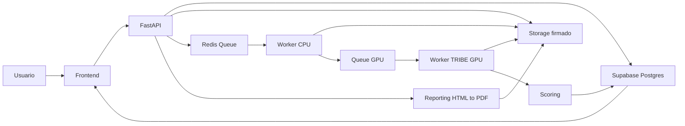

# Arquitectura v0.1

## Tesis tecnica

NeuroImpact Analyzer debe separar cuatro mundos:

- Producto web: experiencia de usuario, proyectos, resultados y PDFs.
- API transaccional: auth, permisos, assets, runs, reports, costes y auditoria.
- Workers: preprocesamiento, inferencia, scoring y generacion de derivados.
- Design/commercial hub: landing, deck, prototipos y documentacion estatica.

Esta separacion evita que la inferencia GPU, los PDFs y la app privada se bloqueen entre si.

## Stack recomendado

| Capa | Decision v0.1 | Motivo |
| --- | --- | --- |
| Landing / Design Hub | GitHub Pages | Estatica, barata, rapida y separada del producto privado. |
| Frontend privado | React + Vite + TypeScript para MVP; Next.js App Router como opcion si se decide SSR/enterprise portal | SPA limpia, rapida, facil de migrar desde prototipo React. Next queda documentado como ruta enterprise si compensa. |
| UI | CSS tokens + componentes React propios | El sistema visual ya existe; no conviene improvisar Tailwind pantalla a pantalla. |
| Backend | FastAPI | Encaja con pipeline Python, workers y validacion de datos. |
| DB/Auth | Supabase Auth + PostgreSQL para MVP; WorkOS como upgrade enterprise | Auth, RLS, SQL fuerte y velocidad para MVP. WorkOS entra si SSO/SAML/Directory Sync son requisito temprano. |
| Storage | Cloudflare R2 o S3-compatible | Upload firmado, coste controlado y separacion por entorno. AWS S3 si el cliente exige AWS-only. |
| Jobs CPU/GPU | Redis + RQ para MVP; Temporal como upgrade si los workflows largos lo justifican | RQ permite empezar simple. Temporal gana si necesitamos cancelacion, reintentos durables y visibilidad compleja. |
| Worker GPU | RunPod Serverless como candidato principal | Buen encaje para trabajos GPU por demanda. Modal o AWS Batch/ECS GPU quedan como alternativas. |
| Modelo | Worker propio con cache de modelo | El modelo no debe depender de Colab ni de un provider compartido. |
| LLM | Router interno configurable | Permite cambiar modelos sin rehacer prompts ni producto. |
| PDF | HTML/CSS print-first + Playwright/Chromium | Respeta `report.html`, tokens, fuentes, `@page` y A4. |
| Observabilidad | Sentry + logs estructurados | Necesario para pilotos corporativos. |

## Monorepo

```text
praevia-neuroimpact/
  frontend/
  backend/
  worker/
  reporting/
  infra/
  design/source/
  docs/
```

## Flujo funcional end-to-end



## Modelo de datos base

Entidades iniciales:

- `profiles`
- `organizations`
- `memberships`
- `workspaces`
- `projects`
- `experiments`
- `assets`
- `asset_versions`
- `upload_sessions`
- `preprocessing_jobs`
- `runs`
- `run_assets`
- `region_scores`
- `network_scores`
- `timecourse_points`
- `peak_moments`
- `recommendations`
- `reports`
- `usage_events`
- `audit_logs`

## Pipeline de analisis

1. Upload firmado a storage.
2. Registro de asset y hash.
3. Health check.
4. Preprocesamiento CPU: metadatos, FFmpeg, audio, transcript, SRT.
5. Job GPU: generar events, ejecutar TRIBE, guardar prediccion.
6. Scoring: ROIs, redes, scores editoriales, picos y valles.
7. Interpretacion: reglas + LLM con salida estructurada.
8. PDF: HTML print-first + renderer.
9. Dashboard: resultados y recomendaciones.
10. Auditoria: coste, modelo, version, benchmark y logs.

## Decisiones de seguridad

- RLS por organizacion desde Sprint 2.
- URLs firmadas para upload/download.
- Separacion de buckets por entorno.
- Secretos fuera del repo.
- Audit log para login, upload, run, report, download y delete.
- Borrado controlado de original, derivados e informes.

## Dependencias criticas

- GPU con VRAM suficiente para inferencia real.
- Token de Hugging Face guardado como secreto.
- Pruebas con assets reales cortos antes de construir scoring avanzado.
- Renderer PDF validado con el `report.html` actual.

## Decision sobre complejidad

Sprint 0 adopta una arquitectura pilot-ready, no enterprise pesada desde el dia uno. Temporal, WorkOS y AWS-only se documentan como upgrade path, no como bloqueo para Sprint 1.

La razon es practica: el primer objetivo es demostrar valor con flujo real, costes controlados y seguridad razonable. Si un piloto exige procurement/SSO/AWS privado, se activa la variante enterprise.
