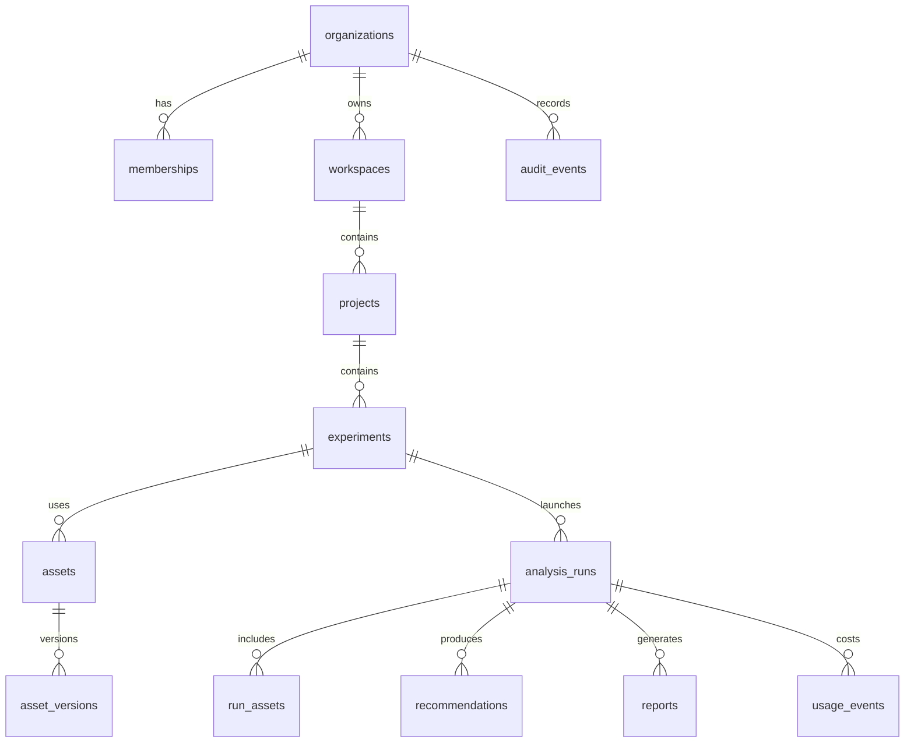

# Modelo de datos v0.1

## Entidades core



## Tablas minimas

- `profiles`
- `organizations`
- `memberships`
- `workspaces`
- `projects`
- `experiments`
- `assets`
- `asset_versions`
- `upload_sessions`
- `preprocessing_jobs`
- `analysis_runs`
- `run_assets`
- `analysis_results`
- `region_scores`
- `network_scores`
- `timecourse_points`
- `peak_moments`
- `recommendations`
- `reports`
- `usage_events`
- `audit_events`
- `model_versions`
- `benchmark_sets`

## Contrato AnalysisResultV1

```json
{
  "schema_version": "analysis-result-v1",
  "run_id": "run_...",
  "organization_id": "org_...",
  "model_version": "tribe-adapter-v0.1",
  "benchmark_version": "demo-benchmark-v0.1",
  "asset_versions": [],
  "scores": {},
  "time_series": [],
  "peaks": [],
  "valleys": [],
  "recommendations": [],
  "confidence": {
    "overall": 0.0,
    "reasons": []
  },
  "provenance": {
    "pipeline_version": "0.1.0",
    "created_at": "2026-05-01T00:00:00Z"
  }
}
```

## Versionado

No se debe sobrescribir:

- Asset version.
- Analysis result.
- Report HTML snapshot.
- Report PDF.
- Prompt version.
- Scoring formula version.

Si algo cambia, se crea una nueva version.

