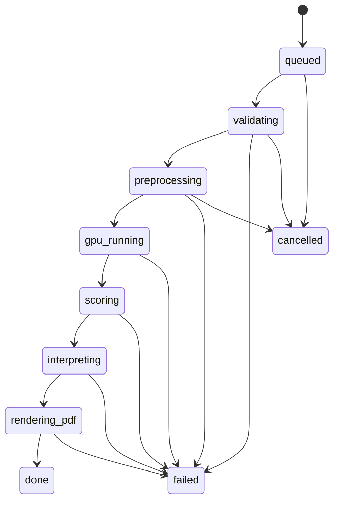

# Ciclo de vida de un run v0.1

## Estados

## Eventos SSE/API

- `run.created`
- `asset.validating`
- `asset.validated`
- `asset.failed`
- `preprocess.started`
- `preprocess.completed`
- `gpu.started`
- `gpu.completed`
- `scoring.completed`
- `interpretation.completed`
- `pdf.completed`
- `run.done`
- `run.failed`

## Reintentos

Permitidos:

- Upload callback perdido.
- Preprocessing temporal.
- LLM timeout.
- PDF renderer timeout.

No automaticos sin revision:

- GPU out of memory.
- Modelo no disponible.
- Asset corrupto.
- Violacion de politica de archivo.

## Cancelacion

Desde MVP:

- Cancelar si run esta en cola.
- Marcar cancelacion solicitada si el worker ya esta procesando.

Post-MVP:

- Cancelacion durable con Temporal si los workflows largos lo justifican.

